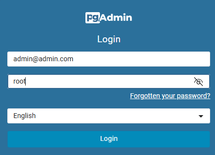
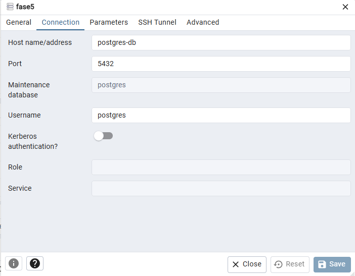
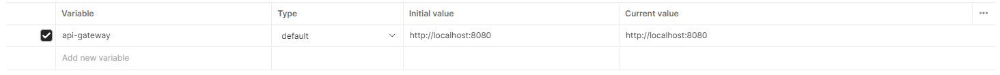

# Tech-Challenge-Fase5
<hr>
Todos os nossos micro-serviços foram desenvolvidos utlizando a versão <b>21 do Java - AmazonCorretto.</b>


## Serviços em nossa aplicação
- [x] PostgreSql
- [x] Pgadmin
- [x] Service-Discovery
- [x] Service-Gateway
- [x] Service-Autenticacao
- [x] Service-Cliente
- [x] Service-Item
- [ ] Service-Pagamento

<hr>

## PostgreSql
Utilizamos a última imagem do Postgre em container para que seja possível efetuar a persistencia de dados dos microserviços utilizados nesse projeto.<br>
Para simular um banco de dados para serviço, utilizamos a criação de Schemas para dividir o banco de dados.<br>
### Schemas
- dbClientes
- dbProdutos
- dbPedidos
- dbUsuarios
- dbPagamentos

## 💻 Configuração Pgadmin
- pgadmin: http://localhost:15432/<br>
  
<br><strong>Configuração do servidor</strong>
  <br>Host name/address: postgres-db
  <br>Username: postgres
  <br>Password: Postgres2023!
  

<hr>

## 🔵 Serviços

### 🔹Service-Discovery
Serviço em Spring Boot 3 utilizando Eureka Server para que seja possível registrar os micros serviços utilizados na aplicação.


### 🔹Service-Gateway
Serviço em Spring Boot 3 utilizando Gateway para que seja possível centralizar todos os micros serviços da aplicação
em um único endereço, facilitando a utilização de todos os serviços com chamada única

### 🔹Service-Autenticacao
Serviço em Spring Boot 3<br>
Esse serviço é utilizado para efetuar a autenticação de todos os serviços utilizados no projeto para gerar um token
que será validado por todos os serviços.

### 🔹Service-Cliente
Serviço em Spring Boot 3 utilizando:
Jpa - Actuator - Discovery Client e OpenFeign<br>
OpenFeign é utilizado para efetuar busca de endereço por Cep, utilizando o serviço ViaCep<br>
Para persistir os dados está sendo utilizado o banco Postgre no schema dbClientes


### 🔹Service-Item - Produtos
Serviço em Spring Boot 3 utilizando:
Jpa - Actuator e Discovery Client<br>
Para persistir os dados está sendo utilizado o banco Postgre no schema dbProdutos


<br>

## 📑 Swagger Documentação
- Microserviço de Clientes - http://localhost:8080/clientes/swagger-ui.html
- Microserviço de Produtos - http://localhost:8080/itens/swagger-ui.html
<br>
<br>

## Eureka - netflix
Para acessar todos os serviços registrados no Eureka acesse:
http://localhost:8761
<br>
<br>

## 🔧 Instalação

```shell
git clone https://github.com/peresricardo/Tech-Challenge-Final
```
### Docker
Criar a rede para utilização dos serviços
```sh
docker network create fase5network
```

### Limpar, compilar e gerar imagem para o docker

Na raiz do projeto existe um arquivo chamado buildAll.bat, executando esse arquivo ele irá
fazer o build, gerar a imagem docker automaticamente de todos os serviços.

```sh
Para executar o arquivo execute um prompt de command "cmd" ou PowerShell
buildAll
```


- SrvDiscovery - Serviço de registro dos micros serviços<br>
  cd srvDiscovery
```sh
mvn clean install
docker image build -t srv-discovery .
```

- SrvGateway - Serviço de centralização do endereço único dos micros serviços<br>
  cd srvGateway
```sh
mvn clean install
docker image build -t srv-gateway .
```

- srvCliente - Micro serviço de clientes<br>
  cd srvCliente
```sh
mvn clean install
docker image build -t srv-cliente .
```

- srvItem - Micro serviço de produtos<br>
  cd srvItem
```sh
mvn clean install
docker image build -t srv-item .
```

- srvAutenticacao - Micro serviço de Autenticação<br>
  cd srvAutenticacao
```sh
mvn clean install
docker image build -t srv-autenticacao .
```


- É possível executar todos os serviços de uma única vez utilizado o arquivo docker-compose que se encontra na raiz da pasta principal do projeto.
<br>Executar o comando abaixo para iniciar os serviços
```sh
docker-compose up -d
```
Executar o comando abaixo para parar os serviços
```sh
docker-compose stop
```


## 🛠️ Execução de testes no projeto
<hr>

- Para executar os testes unitários:

```sh
mvn test
mvn clean jacoco:prepare-agent install jacoco:report
```

## Postman

Na raiz do projeto existe uma pasta chamada <b>Postman</b> que contém a coleção de todos os serviços do projeto.
Facilmente é possível importar as coleções dentro do Postman e utilizar os serviços.<br>

Para utilizar o postman é necessário criar uma variável de ambiente chamada api-gateway:<br>

<br>